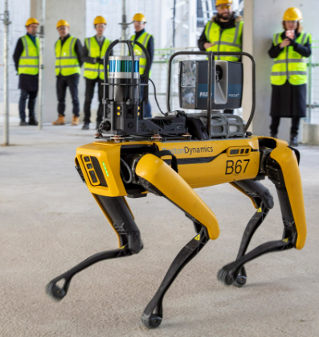
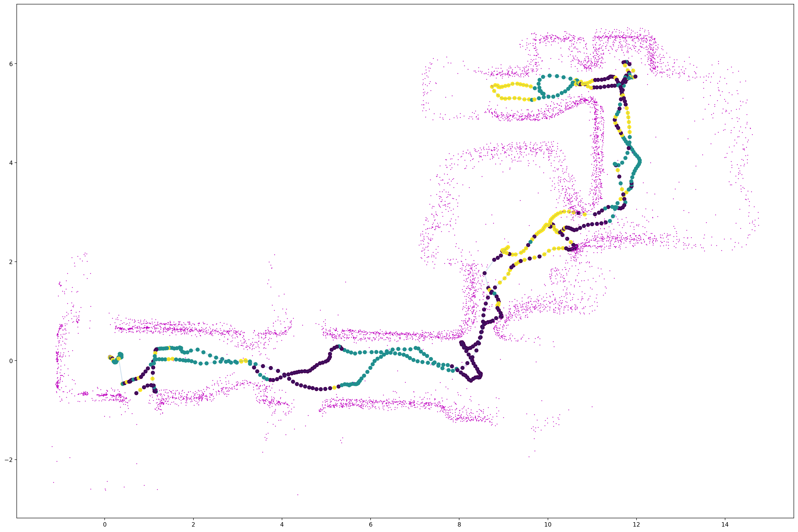

# Laser scan scene classification


## Background

Spot, the Boston Dynamics (BD) robot dog, equipped with a laser scanner mounted on top, records a walk inside and back out of an indoor environment.



<div align="center">spot</div>

The engineers of BD insist on using a low quality laser scanner which only returns 16 radial range measurements. A typical recording, consists of the laser scan measurements along with the pose of the laser scanner (x,y and yaw):


$$
\begin{aligned}
LS_{i}=\{r^0,r^1,..., r^{15} \}_i
\end{aligned}
$$
$$
\begin{aligned}
Pose_i=\{x, y, \psi\}_i
\end{aligned}
$$

**Note:** These measurements are saved in the files named rec10.csv, rec11.csv located in this repository.


Applying a mapping algorithm that processes these measurements yields the following online mapping clip:


And an offline representation of the same data using the graphical python library `matplotlib` looks like so:


In blue are the x,y coordinates of the trajectory spot traveled along, and in magenta are the laser scan measurements (projected on to the same axis).

The code used for the above plot:

```python
import pandas as pd
from matplotlib import pyplot as plt
import numpy as np
from utils import ls2pc

# load recording
file_name = 'rec11.csv'
table = pd.read_table(file_name, delimiter=',')
ranges_i = table[[f'mr18.m{i}' for i in range(16)]].to_numpy(dtype=float)*0.001  # milimeter to meter
x_i = table['stateEstimate.x'].to_numpy()
y_i = table['stateEstimate.y'].to_numpy()
t_i = np.unwrap(np.deg2rad(table['stateEstimate.yaw'].to_numpy()))

# convert ranges to point cloud:
pc_x_r_i, pc_y_r_i, valid_inds_bool_i, valid_inds_i = ls2pc(x_i, y_i, t_i, ranges_i)

# plot data
plt.figure(figsize=(24,16), dpi=200)
plt.plot(pc_x_r_i[valid_inds_bool_i][::15], pc_y_r_i[valid_inds_bool_i][::15], 'm.', markersize=1)
plt.plot(x[::31], y[::31], '-b.', markersize=5)
plt.show()

```

**Note:** ls2pc converts 16 range measurements to points in world coordinates.


The BD engineers want to create a classifier. A classifier that takes as inputs 16 range measurements and decides which of the 3 classes these 16 measurements belong to. The engineers do not care what the meaning of these classes are, as long as the following criterion's are met:

1. Close laser scan readings are classified to the same class with a high probability.

   **Note:** This also means that cyclically shifting a measurement should not influence the classifier.

   For example:
   $$
   \begin{aligned}
   Class(r^0_i,r^1_i,..., r^{15}_i)==Class(r^1_i,..., r^{15}_i,r^0_i)
   \end{aligned}
   $$

2. The occurrences of each class should distribute as even as possible ($1/3, 1/3, 1/3$) over a recording. 

3. The engineers do not want to manually label the data.


An acceptable result should produce the following result:



Here the color of the position marker (poses) represents the classification

### Objective: WIP

Your job is to come up with the classifier and explain your approach. Follow the instructions in the Jupyter-Notebook.

